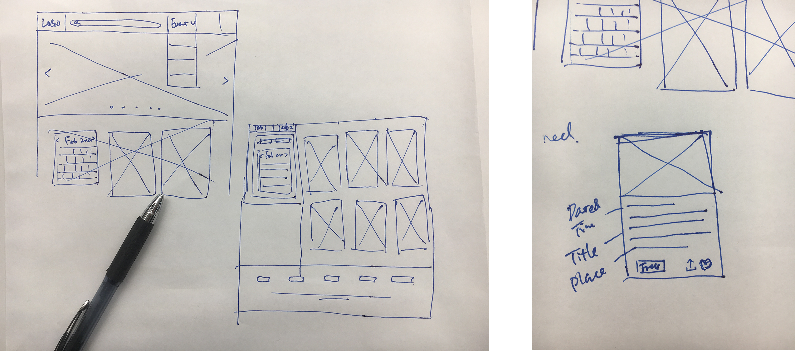
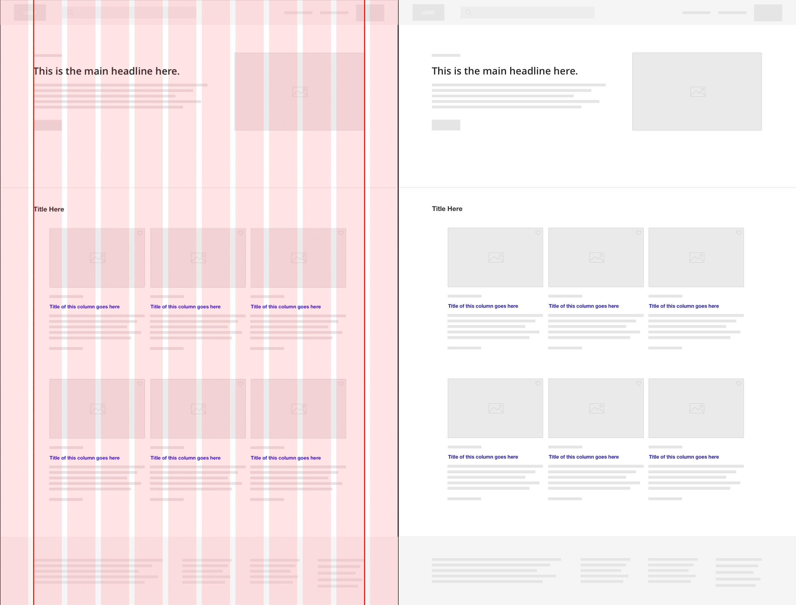
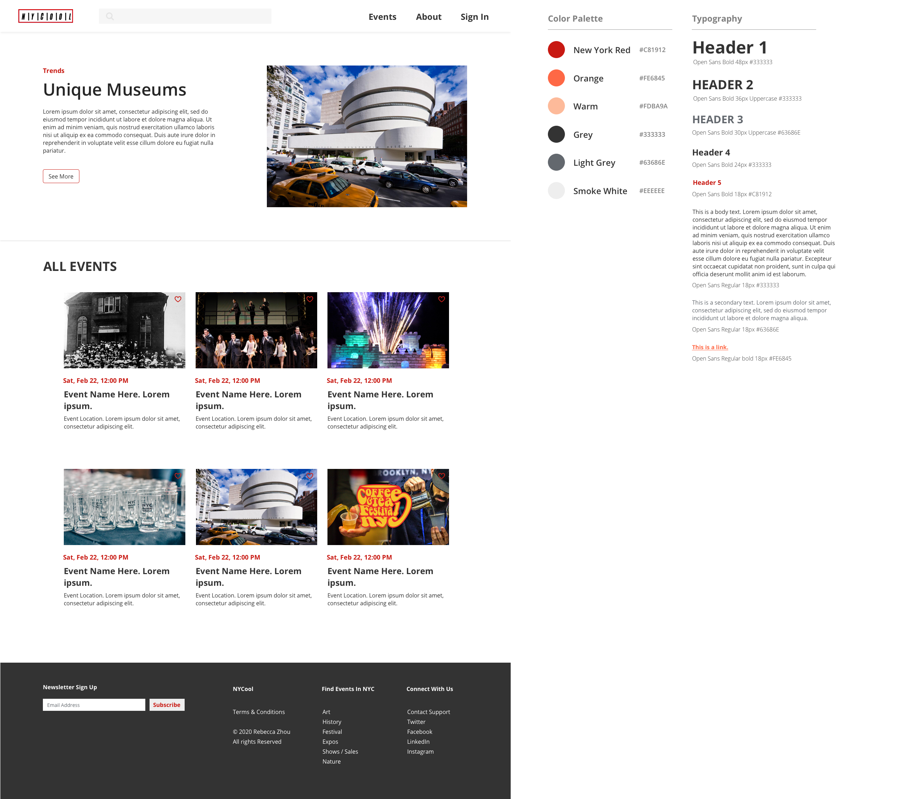
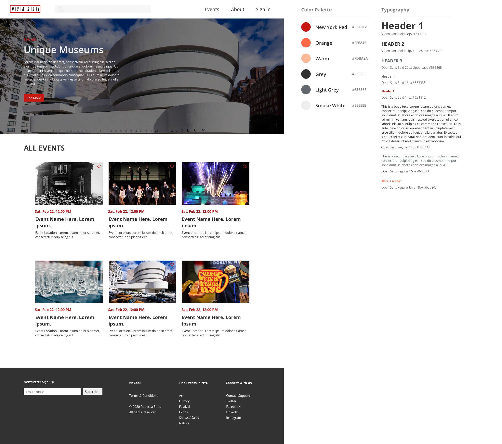
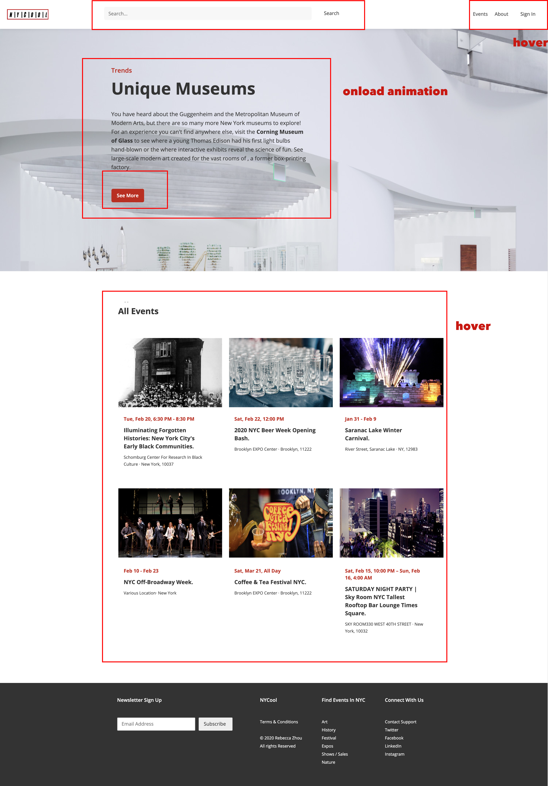

# NYCool

NYCool is a website that provides events in New York City. 
See [NYCool](https://rebeccazhou666-dwd-hw2-1.glitch.me/) Here.

# About
New York is the city that never sleeps! We are fortunate to be a New Yorker and enjoy the endless events in New York. So I designed and built a event-sharing website this week.

# Prerequisites
A text editor or Integrated Development Environment (IDE)- preferably VS Code to view code on your computer if you wish to download.

# Installation
For this particular project, there are no specific installation requirements. Download zip from Github or ```git clone <file-path>``` from command line. 

# Design

To design a event website, first of all, I need some contents.<br />
I found the contents from: [eventbrite](https://www.eventbrite.com/d/ny--new-york/events/) & [ILoveNy](https://www.iloveny.com/)<br />
<br />
After analyzing the contents, I made a requirement for the website.


1. Contains all necessary info about a list events; Date, Name, Place, location, price, save event, share.
2. Featured events promotion
3. Nav bar: including logo, search bar, event menu that can be dropped down, sign in. 
4. Contain links to the detailed pages.
5. SEO: include title and description meta tags
6. Maintenance & Support: css is required to support Chrome and Safari.
7. Hosting: Souce code and design is open source, hosted on Github. Website is publicly accessible and deployed to Glitch.


Then I draw some sketches.


and transformed it to wireframing sketch.


Then, I chose the red used in I-love-NY shirt and created color palette, hierarchy and typography. Furthermore, I exported the detailed visual design for the web. Due to the heavy workload, I cut off the dropdown menu, save, share & price function for events.


# Development

Due to the responsive requirement, I searched online to find how to let website fit as many as browsers as possible. Apart from using ```@media```, there was one small css file named ```normalize.css``` can help create responsive web. So I put it in my ```js``` folder.

I began to create my web based on my wireframe structure. There are mainly four parts of my web: Sticky menu, Featured events, all-events list and footer. It is super frustrated to change the css format. 

During the development, I found that the text hierarchy was not as beautiful as I assumed. So I made some modifications for the web. Here was the second version of visual design.

<br />

<h2> Elegant CSS & Responsive Web</h2>

I used ```border-box``` to keep the css elegant, and also used ```media``` and ```flex``` attribute to allow website more responsive. I didn't change the responsiveness of grids due to the time constraints<br />

<h2> Interactivity</h2>

For interactivity, I wrote ```onload```, ```click```, ```scroll```, ```mouseover/mouseout```, ```onkeypress```functions in ```sketch.js```. However, there was no place to use  ```scroll```, ```mouseover/mouseout```, ```onkeypress``` in the website, so I just annotated them.<br />

<h2> Supportive Interaction</h2>

Currently, the website only supported limited interaction. See the instruction below.<br />

<br />

<h2> Deployment</h2>

Login Glitch.com, create a new project by cloning from Git Repo, and paste the URL to finish.<br /><br />

# Reference
[normalize.css](https://necolas.github.io/normalize.css/)

## Built with

* [VS Code](https://code.visualstudio.com/)
* [Github](https://github.com)
* [Glitch](https://glitch.com/)

## Author

* [Rebecca Zhou](https://rebeccazhou.net) 

